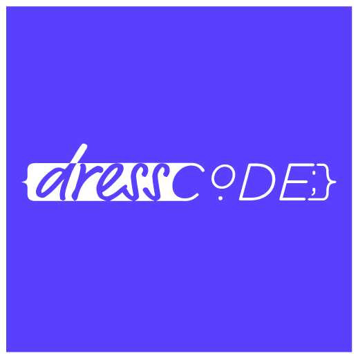

<!-- PROJECT LOGO -->
<br />
<p align="center">
  <a href="https://github.com/Stephen00/dresscode-app">
    
  </a>

  <h3 align="center">SE02 Team Project 2020-21</h3>

  <p align="center">
    Third year team project as part of our honours program at UofG
    <br />
    <a href="https://stgit.dcs.gla.ac.uk/tp3-2020-SE02"><strong>GitLab Repo</strong></a>
  </p>
</p>


<!-- ABOUT THE PROJECT -->
## About The Project

The dressCode web application was created as part of a collaborative team project for our Professional Software Development Course.

The project set out to complete for the customer required the team to design and create a fully functional web app to successfully promote computing science to young students in a fun and engaging manner. The website is also designed to reduce the gender gap within computing science and attract more women to consider the subject as a career path. The specification of the project indicated this had to be done through quizzes, polls and articles and be independent from the current [DressCode](http://dresscode.org.uk/) website.

### Built With

* [React Native](https://reactjs.org/docs/getting-started.html)
* [Django](https://www.djangoproject.com/)
* [Django Rest Framework](https://www.django-rest-framework.org/)
* [Bootstrap](https://getbootstrap.com)

## Contributors

- Stephen Graham - 2385583G
- Martina Borisova - 2382419
- Jose Povedano Poyato - 2403203P
- Thanatad Songpetchmongkol - 2605415s
- Anna Savova - 2327851S
- Ross Beech - 2141893b


## Installation

A video installation of the application can be found [here](https://drive.google.com/file/d/1CGveKqAyNHF3dTD8tHoQ0RctJ7tHt244/view)


### Initial Setup
1. Clone the repository
   ```sh
   $ git clone https://stgit.dcs.gla.ac.uk/tp3-2020-SE02/se02-main.git
   ```
2. Create a virtual enviornment
   ```sh
   $ pip insall virtual env
   $ python -m venv dresscode_env
   $ dresscode_env\Scripts\activate.bat
   ```

## Database Setup

3. Run the following commands
   ```sh
   (dresscode_env) cd se02-main\back-end
   (dresscode_env) pip install -r requirements.txt 
   (dresscode_env) python manage.py makemigrations
   (dresscode_env) python manage.py migrate
   (dresscode_env) python population_script.py
   (dresscode_env) python manage.py create_groups
   (dresscode_env) python manage.py collectstatic
   (dresscode_env) python manage.py runserver
   ```
   
- Now you can navigate to [http://127.0.0.1:8000/](http://127.0.0.1:8000/) and you should be able to see the serialised data that is handled by django-rest framework
- You can access the admin panel through [http://127.0.0.1:8000/admin](http://127.0.0.1:8000/admin) 

(Note: in order to access the administrator panel you will have to create a superuser with `python manage.py createsuperuser`)

### Testing

The following commands will show you how to test the back-end application with already created unit tests. This makes use of the coverage package to run the tests and monitor the current code coverage of the back-end application.

```sh
    coverage erase
    coverge manage.py test
    coverage report
   ```
   you can also run the following for a more detailed and visual report of the code coverage line by line.

   ```sh
   coverage html
   ```
   
## React Client App Setup

4. Install the required packages
```sh
    npm install
   ```
5. Start the front-end application server
```sh
    npm start
   ```
Open [http://localhost:3000](http://localhost:3000) to view it in the browser.

### Additional information
```sh
    npm test
   ```
   
Launches the test runner in the interactive watch mode.\
See the section about [running tests](https://facebook.github.io/create-react-app/docs/running-tests) for more information.

```sh
    npm build
   ```
   
Builds the app for production to the `build` folder.\
It correctly bundles React in production mode and optimizes the build for the best performance.


The build is minified and the filenames include the hashes.\
Your app is ready to be deployed!

See the section about [deployment](https://facebook.github.io/create-react-app/docs/deployment) for more information.

## State of project

Please note that this version of the source code **IS NOT** being maintained and the members of this project will not address any issues. Please contact dresscode [Toni Scullion](https://www.linkedin.com/in/toni-scullion/detail/contact-info/) for any information regarding the state of the DressCode project. This repository servers only for demonstration and showcasing purposes.

<!-- LICENSE -->
## License

Distributed under the MIT License and Commons Clause License. See `LICENSE` for more information.
